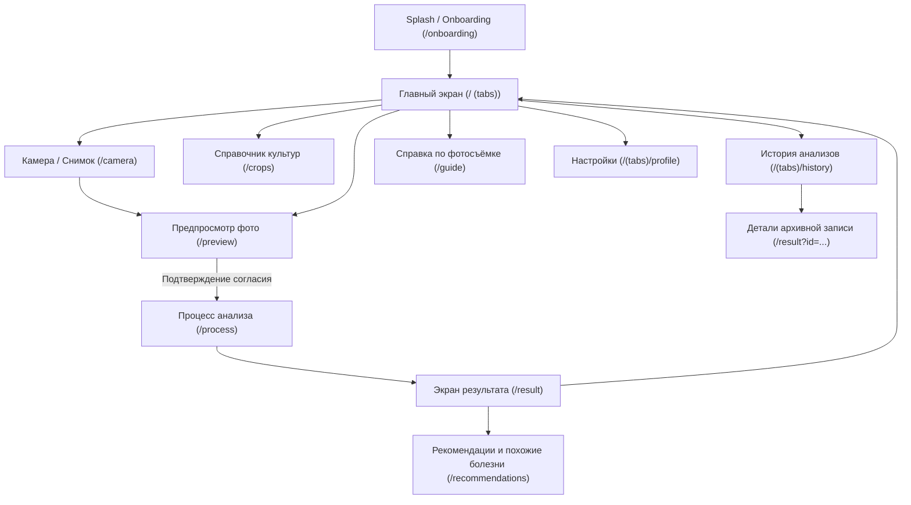

# PlantGuard AI — User Experience & Navigation Flows

**Version**: 1.0.0  
**Framework**: Expo Router (File-based navigation)  
**Date**: September 2026

---

## 1. High-Level Flowchart

---

## 2. Screen Specifications & Transitions

### Flow 1: New Diagnosis (Primary Path)
1. **Trigger**: User taps prominent «Проверить растение» button on Home Screen.
2. **Camera**: Live viewfinder appears with guidance overlay. User takes photo or picks from device gallery.
3. **Preview**: User reviews photo quality and confirms crop (`Томат 🍅`).
4. **Consent (if AI mode)**: Dialog prompts for cloud upload consent.
5. **Processing**: Progress ring animates; image is saved to app sandbox, validated, and processed by active provider.
6. **Result**: Displays diagnosis class, Latin pathogen name, calibrated confidence, limits of visual analysis, and safe actions.
7. **Recommendations**: User navigates to detailed IPM cultural practices and comparisons with similar conditions.

### Flow 2: Offline Demo Exploration
1. **Trigger**: User taps demo card on Home Screen or selects scenario in Analyze tab.
2. **Preview**: Selected demo leaf illustration is shown with `Демо-образец` badge.
3. **Processing**: Evaluated instantly by `DemoProvider`.
4. **Result**: Displays educational demonstration scenario with clear `Учебный сценарий (офлайн)` badge.

### Flow 3: History & Record Management
1. **History Tab**: Displays reverse-chronological list of saved plant analyses.
2. **Filter**: Filters by crop chip («Все», «Томат»).
3. **Item Tap**: Navigates to detail view for full inspection.
4. **Item Delete**: Shows destructive confirmation dialog. On confirmation, record is deleted from AsyncStorage and photo file is unlinked from storage sandbox.
